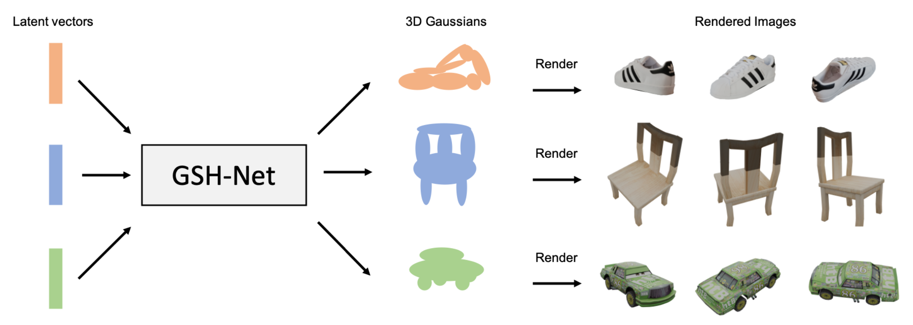
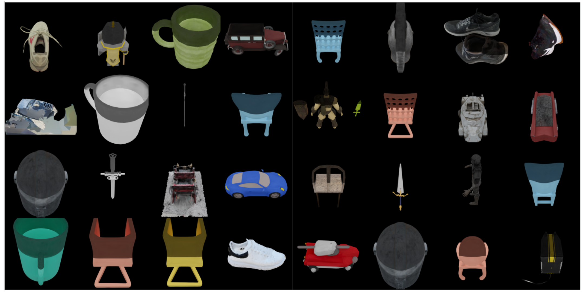
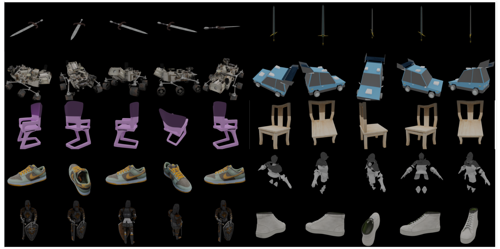
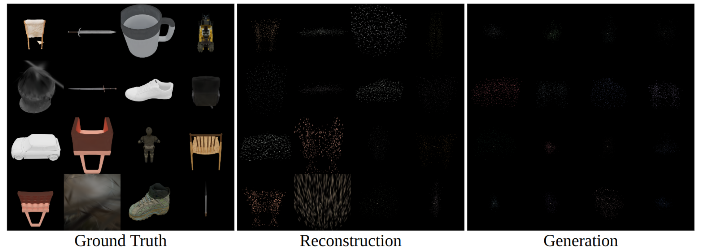

# GSH-Net: Generating High-quality 3D Assets by 3D Gaussian Primitives Generation

#### This is the course final project of CS543 Computer Vision. [[Project Report](assets/CS543_Final_Report.pdf)]



## TL;DR: We attempt to train a Gaussian Splatting Hypernetwork.

## Abstract
3D Gaussian Splatting (3DGS) has demonstrated state-of-the-art performance in multi-view synthesis, achieving photo-realistic rendering quality with minimal training time and allowing for real-time rendering (~100 FPS) during the inference stage. However, existing methods predominantly focus on applying 3D Gaussian Splatting to a single scene, resulting in a learned representation that lacks generalizability across different objects. In this project, we explore the possibility of using 3D Gaussians as the representation of 3D object, and try to model the distribution of 3D objects with a generator. Specifically, we collect a custom set of 3D objects from Objaverse, and optimize 3D Gaussians on all of the objects. To reduce the overhead of modeling the distribution of 3D Gaussians, we adopt a Clipped Coarse-to-fine Adaptive Density Control approach to reduce the dimensionality of 3D Gaussians significantly. In the next stage, we introduce the Gaussian Splatting Hypernetwork (GSH-Net) to directly generate the parameters of Gaussian primitives. These generated primitives are then fed into a Gaussian Splatting rasterized renderer for real-time rendering. The implementation of a simple Variational Autoencoder (VAE) learning paradigm facilitates the unconditional generation abilities of GSH-Net. Although the experimental result of GSH-Net still has room for improvement, we show that it is possible to adopt 3D Gaussians as an underlying representation of 3D objects with the hope to push the boundary of 3D generative AI. The code and the presentation video are uploaded to Canvas.


## Environment Setup

### Install Blender

- Reference: https://www.blender.org/download/

- Reference (Building Blender on server): https://wiki.blender.org/wiki/Building_Blender/Linux/Ubuntu
    ```bash
    sudo apt install build-essential git subversion cmake libx11-dev libxxf86vm-dev libxcursor-dev libxi-dev libxrandr-dev libxinerama-dev libegl-dev
    sudo apt install libwayland-dev wayland-protocols libxkbcommon-dev libdbus-1-dev linux-libc-dev
    sudo apt install libsm6

    # or all in once
    sudo apt install build-essential git subversion cmake libx11-dev libxxf86vm-dev libxcursor-dev libxi-dev libxrandr-dev libxinerama-dev libegl-dev -y && sudo apt install libwayland-dev wayland-protocols libxkbcommon-dev libdbus-1-dev linux-libc-dev -y && sudo apt install libsm6 -y
    ```

### Install Python packages

- Follow https://github.com/graphdeco-inria/gaussian-splatting for installing 3D Gaussian Splatting environment. (using CUDA 11.8 recommended)

- Install [Objaverse API](https://objaverse.allenai.org):
    ```bash
    pip install objaverse
    ```


## Run Code Step-by-Step

### Dataset Sampling from Objaverse
```bash
bash dl_objaverse.sh

python download_objaverse.py \
    --output_dir $DATA_ROOT_DIR \
    --start_index $START_INDEX \
    --end_index $END_INDEX \
    --use_lvis
```
- ***output_dir***: path to target download folder
- ***start_index***: starting index in object ID list
- ***end_index***: ending index in object ID list (-1 for whole list)
- ***use_lvis***: use LVIS annotations in Objaverse 1.0 for specific object categories, specify desired category names in ***object_names_list***.

### Dataset Rendering in Blender
```bash
bash rend_objaverse.sh

export BLENDER_PATH='path_to_blender'
$BLENDER_PATH --background --python bpy_render_views.py -- \
    --data_dir ./data_objaverse/ \
    --output_path ./data_objaverse_render/ \
    --num_views 100 \
    --resolution 800 800 \
    --device cuda
```
- ***num_views***: number of rendered views (default: 100)
- ***resolution***: image resolution (default: 800 800)
- ***device***: use GPU for rendering in Blender

### Training 3D Gaussians
```bash
bash train_gs.sh   # training
bash vis_gs.sh     # visualizing in viewer
bash rend_gs.sh    # rendering images
```

### Training GSH-Net
```bash
bash launch_train_stage2.sh
```

### Utility Functions (if required)
```bash
# download assets from ShapeNet
wget http://shapenet.cs.stanford.edu/shapenet/obj-zip/ShapeNetCore.v1.zip
python download_shapenet.py \
    --shapenet_dir ../ShapeNetCore.v1/
    --output_dir .

# convert into NeRFStudio data format
python transform_ns_format.py --input_dir data_objaverse_render/
```


## Results

### Rendering of Optimized 3D Gaussians


### Rendering of Optimized 3D Gaussians (Multi-view)


### Rendering of Reconstructed and Generated 3D Gaussians



## Potential Future TODOs

- [  ] reduce the dimensions of spherical harmonics (currently 48)
- [  ] add Fourier embedding for each attribute (e.g. position, rotation, opacity...etc.)
- [  ] replace VAE with Point-E [[Link](https://github.com/openai/point-e)]


## Citation

Kudos to the authors of 3D Gaussian Splatting:

```
@Article{kerbl3Dgaussians,
    author       = {Kerbl, Bernhard and Kopanas, Georgios and Leimk{\"u}hler, Thomas and Drettakis, George},
    title        = {3D Gaussian Splatting for Real-Time Radiance Field Rendering},
    journal      = {ACM Transactions on Graphics},
    number       = {4},
    volume       = {42},
    month        = {July},
    year         = {2023},
    url          = {https://repo-sam.inria.fr/fungraph/3d-gaussian-splatting/}
}
```

If you find this implementation useful or interesting, please consider to cite:

```
@misc{cheng2023gshnet,
  title={GSHNet},
  author={Cheng, Yen-Chi and Hsu, Hao-Yu},
  publisher = {GitHub},
  journal = {GitHub repository},
  howpublished={\url{https://github.com/haoyuhsu/hyper-gaussian-splatting}},
  year={2023}
}
```